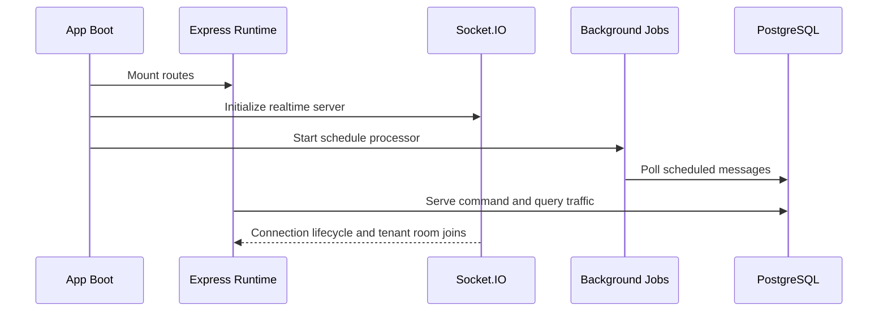

# Runtime Model

## Scope

This document describes the runtime behavior of the current repository, which is implemented as a centralized Node.js orchestration server rather than a fleet of autonomous agents.

## Runtime Topology

The runtime has four active execution modes:

- synchronous HTTP request handling
- webhook-driven provider event ingestion
- Socket.IO real-time fan-out
- interval and cron-based background processing

## Operator Console Runtime

The frontend runtime changed substantially on May 15, 2026.

Current console behavior:

- route modules are lazy-loaded through `React.lazy` in `frontend/src/main.jsx`
- a `Suspense` fallback now covers route loading
- an application-level error boundary prevents a full blank screen during render failures
- the inbox is no longer a single monolithic page and now delegates work to `frontend/src/pages/inbox/components.jsx`, `hooks.js`, and `helpers.jsx`

Operational implications:

- the initial bundle is smaller because page routes are loaded on demand
- inbox maintenance risk is reduced because ticket state, message state, and realtime handling are separated
- UI failures now degrade to bounded fallbacks rather than a global black screen

## Agent Lifecycle

The product includes a standalone local Firebird/iLux agent used for synchronization,
service-order commands and financial-document monitoring. The cloud runtime remains
the orchestration and authorization layer; the agent is the local execution boundary
for the Firebird database and UNC document folders.

Lifecycle phases:

1. boot server and mount routes
2. initialize Socket.IO
3. initialize background schedulers
4. process operator requests
5. ingest provider webhooks
6. persist state mutations
7. emit real-time UI updates

## Heartbeat System

Current heartbeat behavior is implemented through the Firebird agent ping endpoint and
Socket.IO transport settings in `backend/src/app.js`.

Observed settings:

- `pingTimeout: 60000`
- `pingInterval: 25000`
- `connectTimeout: 45000`
- transports: websocket and polling

This heartbeat covers operator-console connectivity, not provider connectivity.

Provider session health is inferred separately through:

- Evolution connection state polling in `instanceController.list`
- webhook `connection.update` events

## Reconnect Logic

### Frontend Reconnect

The frontend uses Socket.IO client reconnection behavior in the inbox workflow and refreshes tickets on reconnect.

### Provider Reconnect

Provider reconnect is handled operationally rather than by a local protocol stack:

- QR code and pairing are managed through Evolution
- provider disconnections trigger `connection.update`
- the backend propagates the event to the tenant room
- admins can reconnect the affected instance through the console

### Runtime Retry Loops

The background processor also includes recovery logic for media:

- pending media is retried every 5 minutes
- stale pending media is marked failed after threshold expiration

## Session Persistence

Session persistence exists at three layers:

### 1. Provider Session Persistence

WhatsApp connection state is effectively owned by Evolution API.

### 2. Application Persistence

The application stores durable operational context:

- instances
- contacts
- tickets
- messages
- ticket events
- scheduled work
- knowledge artifacts

### 3. Local File Persistence

Media assets are stored under local `uploads/` paths and served statically.

## Browser Orchestration

Current production runtime does not execute a browser automation layer.

Important nuance:

- the Prisma schema includes `MetaInstance` and `metaBrowserSession`
- this indicates planned support for browser-backed or hybrid session persistence for Meta channels
- no active browser runtime exists in the current controllers or services

The repository is therefore API-first today, with reserved schema for future hybrid execution.

## Runtime State Management

The dominant state manager is PostgreSQL through Prisma.

State coordination patterns:

- `Ticket.status` controls queue state
- `Ticket.agentId` determines ownership
- `Ticket.unreadCount` tracks operator attention
- `Message.mediaStatus` manages media recovery lifecycle
- `TicketEvent` acts as an append-only operational history stream

The runtime uses database state as the source of truth and Socket.IO as a projection channel.

## Failure Recovery

### Request-Level Failures

- controller `try/catch` blocks return HTTP errors
- performance logging highlights slow endpoints
- global `uncaughtException` and `unhandledRejection` handlers log fatal failures

### Provider-Level Failures

- Evolution requests are wrapped with retries or fallbacks where appropriate
- media retrieval tries multiple provider endpoints
- provider connection events are pushed to admins

### Console-Level Failures

Recent console hardening introduced layered recovery behavior:

- app-level render failures fall back to a recovery screen in `frontend/src/main.jsx`
- inbox sections can fail independently instead of collapsing the entire conversation view
- malformed history entries, missing media fields, and inconsistent payload shapes are guarded before render
- surfaced render errors were used operationally to isolate the final inbox issue during production rollout on May 15, 2026

### Media Recovery

`scheduleProcessor.retryPendingMedia` provides compensating behavior for failed or delayed media fetches.

### Scheduled Work Recovery

Scheduled messages are polled from durable storage, so a restart does not erase pending work.

## Local Execution Model

The current runtime is suitable for a single process or small horizontally scaled deployment, with caveats:

- cron and interval jobs are process-local
- Socket.IO state is in-process
- uploads are stored on local filesystem
- no distributed lock or leader election exists

This means the repository currently behaves best as:

- one active application runtime per deployment unit
- or multiple replicas with external coordination added later

Deployment notes from May 15, 2026:

- the frontend now defines explicit build/start behavior through `frontend/nixpacks.toml`
- `frontend/package.json` includes a production `start` script using `serve dist -l 3000 -s`
- this was added after a production incident where the frontend container served an outdated `dist` build

## Runtime Sequence

## Gemini runtime profiles

The backend uses the maintained `@google/genai` SDK and keeps model selection
server-side. Each profile has ordered fallbacks; the first available model is
used and the selected model is written to the application log without prompt
or customer data.

- `GEMINI_CHAT_MODELS`: `gemini-3.7-flash`, `gemini-3.6-flash`, `gemini-2.5-flash`
- `GEMINI_LIGHT_MODELS`: `gemini-3.5-flash-lite`, `gemini-3.1-flash-lite`, `gemini-2.5-flash-lite`
- `GEMINI_MULTIMODAL_MODELS`: `gemini-3.7-flash`, `gemini-3.6-flash`, `gemini-2.5-flash`

Gemini 3 chat requests use low thinking effort for predictable WhatsApp
latency. Light tasks use minimal effort where supported. Gemini 2.5 fallbacks
retain their compatible zero-budget configuration. Do not add legacy sampling
parameters to Gemini 3.6/3.7 requests.

## Knowledge retrieval

Every reply generated by the WhatsApp bot queries the tenant's active knowledge
base before calling Gemini. Retrieval is hybrid: semantic similarity is used
when an embedding exists and keyword/tag overlap remains available as a
fallback. Only relevant matches are added to the prompt; merely consulting the
base does not force unrelated content into the answer.

The default conservative thresholds are `KNOWLEDGE_SEMANTIC_MIN_SCORE=0.64`
and `KNOWLEDGE_LEXICAL_MIN_SCORE=0.34`. Each consultation is recorded in
`KnowledgeLog`, including whether a match was used, its method and failures.
The admin screen provides index status, seven-day usage indicators, reindexing
and a dry-run search that never sends a customer message.

### Cross-language retrieval

Manuals can be English-only while technicians ask in Portuguese. Two things keep
that working:

- Every embedding request now carries a `taskType`: `RETRIEVAL_QUERY` for the
  user's question, `RETRIEVAL_DOCUMENT` for stored content (chunks and the
  answer base). `gemini-embedding-001` uses the hint to place asymmetric
  query/document pairs closer, which lifts PT↔EN similarity.
- When the tenant has at least one published document whose `language` is not
  Portuguese, `searchTenantKnowledge` also asks the light model for an English
  translation of the query (~60 tokens), embeds it as a second
  `RETRIEVAL_QUERY` vector, and scores every item against the best of the two
  vectors. Translation failure falls back to the original query only; a base
  that is entirely Portuguese never pays the extra call. The response returns
  `crossLanguage: true` when the translated vector was used.

Cross-lingual matches often land at ~0.55–0.63 semantic, just under the default
cut. `KNOWLEDGE_SEMANTIC_MIN_SCORE_CROSSLANG` (default `0.55`, clamped to never
exceed `KNOWLEDGE_SEMANTIC_MIN_SCORE`) is the semantic threshold applied only to
items whose document `language` differs from the query language (`pt-BR`); the
answer base and Portuguese manuals keep the strict `0.64`.

Existing embeddings do **not** need reindexing for this change: dimensions are
unchanged and `cosineSimilarity` stays valid, so old vectors keep working and
already benefit from query translation. Reprocessing a document / reindexing the
answer base only adds the `RETRIEVAL_DOCUMENT` hint, a further recall
improvement, not a correctness fix.

The manufacturer/model gate is a ranking signal, not a hard filter. A chunk
whose document `manufacturer`/`equipmentModel` is neither named in the query nor
present in the ticket's linked equipment is not dropped — its score is
multiplied by `KNOWLEDGE_MODEL_MISMATCH_PENALTY` (default `0.8`). This is what
lets a manual that documents the exact error code the technician typed still
surface when they don't spell out the model (and in the base's "Testar consulta"
simulator, which has no equipment context at all). Naming the manufacturer in
the query (`xerox 303-403`) already clears the gate with no penalty.

### Document indexing (large manuals)

Uploaded documents are processed in a dedicated child process launched with
`--expose-gc` and a capped old-space heap (`KNOWLEDGE_WORKER_HEAP_MB`, default
`512`). On Linux a watchdog SIGKILLs the worker if its RSS passes
`KNOWLEDGE_WORKER_RSS_MB` (default `768`); the document then shows `FAILED` with
a generic "safety limit" message that also covers transaction timeouts, so a
`FAILED` manual is not necessarily an out-of-memory.

To keep the peak bounded, PDF text is extracted in page windows of
`KNOWLEDGE_PDF_PAGE_BATCH_SIZE` pages (default `12`): a fresh `PDFParse` runs per
window and is destroyed, with `global.gc()` between windows, so pdf.js
font/image caches never accumulate across the whole manual. Smaller windows are
safer for image-heavy PDFs (few pages, large XObjects); larger windows are much
faster for long text manuals — e.g. a 54 MB / 1487-page service manual extracts
in ~34 s at `12` vs ~20 s at `200`, with a similar ~400 MB peak either way.

Embeddings use `gemini-embedding-001` at `GEMINI_EMBED_DIMENSIONS` dimensions
(default `768`). The Google default of `3072` made the chunk write for a big
manual (thousands of rows, each carrying the vector) spike ~650 MB and trip the
RSS guard — the real bottleneck, not the PDF extraction. `768` is Google's
recommended size for most use, cuts stored/compared vector size 4×, and the
chunks are written in `KNOWLEDGE_CHUNK_BATCH_SIZE` (default `100`) `createMany`
batches with `global.gc()` between them, no wrapping transaction. **Existing
bases embedded at 3072 must be reindexed after this change** — `cosineSimilarity`
returns 0 on a dimension mismatch, so old vectors silently fall back to lexical
search until their document is reprocessed / the answer base is reindexed.
